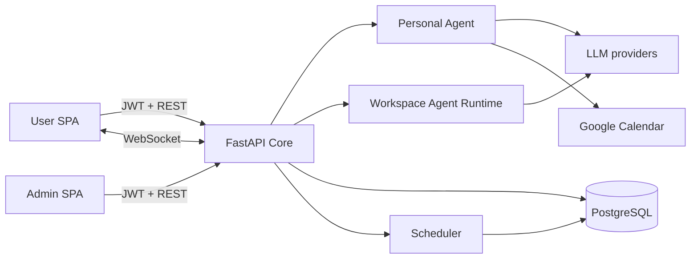

# Kiến trúc hệ thống Orbit

> **Phạm vi canonical:** sản phẩm nền tảng Personal Agent và ranh giới tích hợp với phần phát triển Workspace. Kiến trúc chi tiết của Workspace nằm tại [`workspace-development/`](workspace-development/README.md).

## 1. Hai lớp sản phẩm

| Lớp | Vai trò | Trạng thái |
|---|---|---|
| Personal Agent | Chat, task, reminder, calendar, memory và AI theo consent của từng user | Sản phẩm nền tảng, flow mặc định |
| Workspace Multi-Agent | Agent chuyên môn Delivery/QA và tổng hợp theo Workspace | Phần phát triển mở rộng; có code/test, chưa phát hành mặc định |

Hai lớp dùng chung identity, PostgreSQL, WebSocket, model gateway và policy nền. Dữ liệu cá nhân không tự động trở thành dữ liệu Workspace; membership và resource binding phải được backend xác nhận.

## 2. System context



Backend là modular monolith: REST, WebSocket, Personal Agent, scheduler và embedded Workspace runtime có thể chạy trong cùng process. `render.production.yaml` cũng mô tả topology tách runtime khi cần cô lập hơn.

## 3. Thành phần chính

| Khu vực | Đường dẫn | Trách nhiệm |
|---|---|---|
| Bootstrap | `src/main.py`, `src/config.py` | Settings, lifespan, router, scheduler, health |
| API | `src/api/` | Auth, chat, task, calendar, Workspace và agent routes |
| Personal Agent | `src/agents/graph.py`, `src/agents/nodes/` | Lập kế hoạch, context, quality gate và tool flow cá nhân |
| Workspace Agent | `src/agents/profiles/`, `delivery_*`, `src/agents/tools/` | Delivery/QA runtime, guardrail, brief và orchestration |
| Policy/runtime | `src/agents/policies/`, `src/agents/runtime/` | Scope, resource guard, execution isolation |
| Services | `src/services/` | Business logic, integration, memory và scheduling |
| Persistence | `src/db/` | SQLAlchemy model và Alembic migration |
| User UI | `Frontend/user/` | Personal và Workspace experiences |
| Admin UI | `Frontend/admin/` | Platform và Workspace control plane |

## 4. Personal Agent flow

```text
Authenticated user
→ resolve personal scope and optional conversation consent
→ build trusted context on the server
→ run LangGraph planner/profile
→ execute read-only tool or create an HITL proposal
→ return answer / wait for confirmation
→ revalidate actor, payload and permission before side effect
```

Calendar và Reminder write operations không được thực thi chỉ vì model yêu cầu. Người dùng phải xác nhận, và trạng thái phải được kiểm tra lại khi resume.

## 5. Workspace extension boundary

Workspace request phải đi qua membership-derived discovery, profile routing và resource guard. Client không được tự cấp role, profile hoặc allowlist. Delivery/QA chỉ đọc nguồn đã bind; luồng aggregate không mặc định đọc raw chat liên phòng ban.

Các feature flag sau kiểm soát rollout và mặc định tắt trong `.env.example`:

- `MULTI_AGENT_ENABLED`
- `PRODUCT_DELIVERY_AGENT_ENABLED`
- `QUALITY_ASSURANCE_AGENT_ENABLED`
- `EXECUTIVE_AGENT_ENABLED`

Trạng thái triển khai chi tiết nằm trong [Workspace Development Report](workspace-development/DEVELOPMENT_REPORT.md).

## 6. Data và authorization boundary

- JWT xác thực danh tính; backend quyết định authorization theo resource.
- Platform Admin không mặc định có quyền đọc nội dung chat nghiệp vụ.
- Conversation context phải qua participant/consent policy trước khi tới model.
- Personal data thuộc đúng owner; Workspace data cần Company/Workspace membership và binding hợp lệ.
- Secret và token lấy từ environment; Calendar credential được mã hóa trước khi lưu.
- Prompt, tool result và message content được coi là dữ liệu không tin cậy.

## 7. Persistence và background work

PostgreSQL là database runtime. Alembic quản lý schema. LangGraph checkpoint và memory giúp thread sống qua restart. Scheduler xử lý reminder, Calendar polling, memory cleanup và Workspace outbox/maintenance.

Vì WebSocket registry và một số scheduler/runtime state gắn với process, không được tự ý scale nhiều replica nếu chưa có coordination/leader strategy phù hợp.

## 8. Frontend

- User app: `Frontend/user`, cổng local `5173`.
- Admin app: `Frontend/admin`, cổng local `5174`.
- `/assistant`, `/chat`, `/tasks`, `/calendar`, `/reminders`, `/memory` là Personal surfaces.
- `/workspaces`, `/channels`, `/workspace-agent` là Workspace development surfaces.

UI guard chỉ phục vụ trải nghiệm; backend luôn là lớp quyết định quyền.

## 9. Kiểm thử và bằng chứng

- Backend: `tests/`.
- Evaluation và machine-readable artifacts: [`eval/`](../eval/README.md).
- Manual test: [`eval/manual/`](../eval/manual/MANUAL_TEST_REPORT.md).
- Workspace-specific design/evidence: [`docs/workspace-development/`](workspace-development/README.md) và dataset trong `eval/datasets/`.

## 10. Giới hạn công bố

Sự tồn tại của route, UI hoặc test Workspace chỉ chứng minh mức `Implemented/Tested`; không chứng minh `Released`. Mọi tuyên bố production phải gắn với commit, môi trường và acceptance evidence tương ứng.
